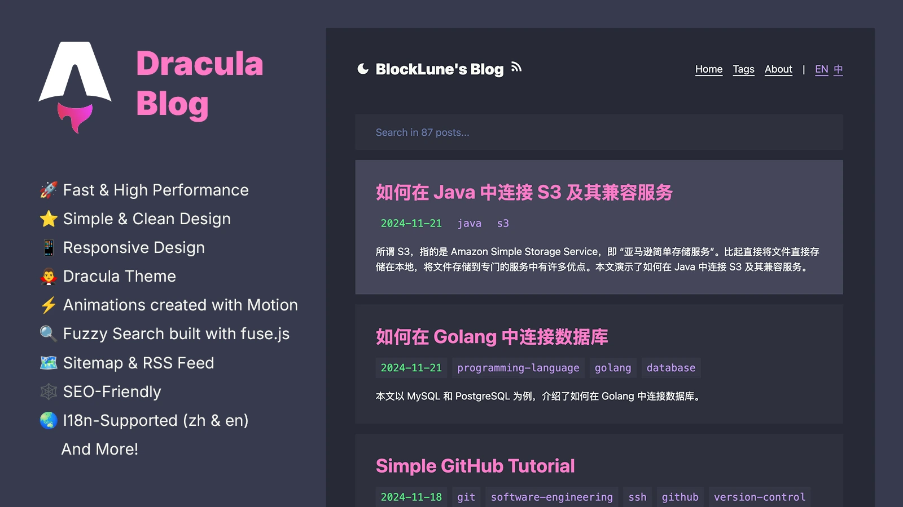

# Astro Dracula Blog

<p>
    <a href="https://blocklune.cc"><strong>🛑 Live Demo</strong></a>&nbsp;&nbsp;/&nbsp;&nbsp;
    <a href="doc/gallery.md"><strong>🖼️Gallery</strong></a>&nbsp;&nbsp;/&nbsp;&nbsp;
    <strong>🌏 English</strong>&nbsp;&nbsp;/&nbsp;&nbsp;
    <a href="doc/readme_zh.md"><strong>🌏 简体中文</strong></a>
</p>

🌟 A fast and simple blog system with dracula theme built with Astro v5.

[](doc/gallery.md)

## :fire: Features

- [x] :rocket: Fast & High Performance
- [x] :star: Simple & Clean Design
- [x] :iphone: Responsive Design
- [x] :vampire_man: Dracula Theme
- [x] :zap: Animations created with [Motion](https://motion.dev) (the original Framer Motion)
- [x] :mag: Fuzzy Search built with [fuse.js](https://www.fusejs.io/)
- [x] :world_map: Sitemap & RSS Feed
- [x] :spider_web: SEO-Friendly
- [x] :earth_asia: I18n-Supported (`zh` & `en`)
- [x] :triangular_ruler: Mathjax
- [x] :octocat: [GitHub Alerts](https://github.com/chrisweb/rehype-github-alerts)
- [x] :book: TOC (Table of Contents)
- [x] :framed_picture: Dynamic Open Graph Generation for Posts
- [x] :copyright: Project under MIT License & Support License customization for each post

## :white_check_mark: Lighthouse Score

<p aligh="center">
    <a href="https://pagespeed.web.dev/analysis/https-blocklune-cc/72o0c25cxa?form_factor=desktop">
        
    </a>
</p>

## :rocket: How To Use

File structure:

```text
.
├── astro.config.mjs
├── package.json
├── public/
├── src/
│   ├── assets/
│   │   └── avatar.webp
│   ├── components/
│   ├── config.ts
│   ├── content.config.ts
│   ├── content/
│   │   ├── drafts/
│   │   │   └── ...
│   │   ├── info/
│   │   │   ├── en/
│   │   │   │   └── about.md
│   │   │   └── zh/
│   │   │       └── about.md
│   │   └── posts/
│   │       ├── en/
│   │       │   └── example-post.md
│   │       └── zh/
│   │           └── example-post.md
│   ├── middleware.ts
│   ├── pages/
│   ├── schemas/
│   ├── styles/
│   └── utils/
├── tailwind.config.mjs
└── tsconfig.json
```

To use this theme, follow these steps:

1. Edit `src/config.ts` to configure the basic information for your site. You can also configure your [umami](https://umami.is/) analytics and search engine verifications here.
2. Replace `src/assets/avatar.webp` with your own avatar.
3. Rewrite your own about page text in `src/content/info/en/about.md` & `src/info/zh/about.md` (**📌Note: Please retain the license information contained therein and, if possible, the url for this project❤️.**).
4. Delete my posts in `src/content/posts` and write your own. Currently the theme supports both Chinese and English languages, for different language versions of the same post, you need to make sure they are located in the `en` and `zh` directories and use the same filename.
5. Remove `public/_redirects` and use your own Netlify redirect configuration.
6. Remove the icons in `public` and use your own. The commands below may be helpful:

```bash
# https://github.com/yy4382/yfi.moe/blob/main/app/blog/src/components/modules/head/Favicon.astro
mkdir magic
magick logo.png -resize 16  ./magic/favicon-16.png
magick logo.png -resize 32  ./magic/favicon-32.png
magick logo.png -resize 48  ./magic/icon-48.png
magick logo.png -resize 96  ./magic/icon-96.png
magick logo.png -resize 144 ./magic/icon-144.png
magick logo.png -resize 192 ./magic/icon-192.png
magick logo.png -resize 256 ./magic/icon-256.png
magick logo.png -resize 384 ./magic/icon-384.png
magick logo.png -resize 512 ./magic/icon-512.png
magick logo.png -resize 120 ./magic/apple-touch-icon-120.png
magick logo.png -resize 152 ./magic/apple-touch-icon-152.png
magick logo.png -resize 167 ./magic/apple-touch-icon-167.png
magick logo.png -resize 180 ./magic/apple-touch-icon-180.png
magick ./magic/favicon-32.png ./magic/favicon-16.png ./magic/favicon.ico
```

### Write a New Post

To start writing a new post, you can use the `pnpm new` command (see below), or follow these steps:

1. Create a file in `src/content/posts/en` if you are writing the English version of a post, say `hello-world.md`.
2. Edit the file `src/content/posts/en/hello-world.md` like this:

```text
---
title: Hello World
tags:
- hello
- my-first-post
date: 2024-11-12 18:50:00
---

Hello! This is my first post!

<!--more-->

I'm writing my first post!
```

Currently, Frontmatter supports the following properties

- `title`: the title of a post
- `tags`: the tags of a post
- `date`: the published date of a post
- `updated`: the updated date of a post
- `license`: the license of a post, set to `none` to disable the license for a specific post
- `licenseLink`: the license link
- `ogImageUrl`: specify an Open Graph image for a specific post

### Customize License

To customize default license, edit the `src/config.ts` file. To customize the license for a specific post, edit the `license` property in the Frontmatter of the post file.

### Customize Color Scheme

To customize the color scheme of this theme, edit the following files:

- `src/components/style/prose.astro`
- `src/styles/global.css`
- `src/styles/rehype-github-alerts.css`
- `tailwind.config.mjs`

### I18n Configuration

Currently this theme supports both Chinese and English, and uses English as its default language.

To switch it to Chinese:

- Edit `src/utils/i18n.ts`:

```ts
export const defaultLang : Lang = "zh";
```

- Edit `public/_redirects` (Make sure these are at the end of the file):

```text
/ /en 302! Language=en
/ /zh 302!
```

### Useful Commands

```bash
# install dependencies
pnpm install

# start the dev server
pnpm dev

# build the project
pnpm build

# preview (after the build)
pnpm preview

# create a new post (or draft)
pnpm new
```

More detailed usage of `pnpm new` (The output of `pnpm new --help`):

```text
Usage: pnpm new [options] <post-title>

Options:
  -l, --lang <en|zh>   Set the language (default: en)
  -d, --draft          Create a draft post (default: false)
  -m, --mdx            Use MDX format (default: false)
  -h, --help           Show this help message

Example:
  pnpm new "Hello World"
  pnpm new -l zh "你好，世界"
```

> [!Caution]
> Due to [the slug generation library used](https://www.npmjs.com/package/slugify), an empty slug will be generated for a full Chinese title like “你好，世界”, which will result in a file called `Untitled.md`.

## :books: The Story

This is my fourth attempt at building a blog system. My journey began at the tender age of 14, when I first dabbled in creating a blog. I learned the basics of HTML in a junior high computer class, and furthered my knowledge through resources such as [doyoudo](https://www.bilibili.com/video/BV1gp411f7j6). My first attempt at blogging was a simple static site created with HTML & CSS, no JavaScript, and hosted on GitHub Pages.

As I approached college, I experimented with [Hexo](https://hexo.io/) and the [Icarus](https://ppoffice.github.io/hexo-theme-icarus/) theme for my second blog. For the third iteration, I continued using Hexo, but this time with the [NexT](https://theme-next.js.org/) theme. Using a framework like Hexo greatly streamlines the blogging process, allowing me to focus on content creation. However, I have always felt the "weight" of using a framework.

Determined to create a blog that was truly my own, I decided to build one from the ground up. And here it is!

The blog is mainly built with [Astro](https://astro.build/) with [React](https://react.dev/) components. I chose Astro because it is super fast. The color scheme is inspired by [Dracula](https://draculatheme.com/). I use [Tailwind CSS](https://tailwindcss.com/) for styling and [Tailwind Typography](https://github.com/tailwindlabs/tailwindcss-typography) for typography. And I do some animations with [Motion](https://motion.dev) (the original Framer Motion).

## :link: References

- [Dracula Theme](https://draculatheme.com/contribute)
- [overreacted.io - Dan's blog](https://overreacted.io/)
- [bearblog.dev](https://bearblog.dev/)
- [Astro Docs](https://docs.astro.build/)
